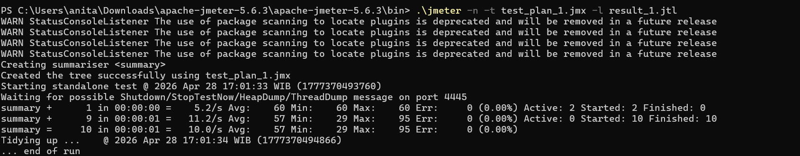
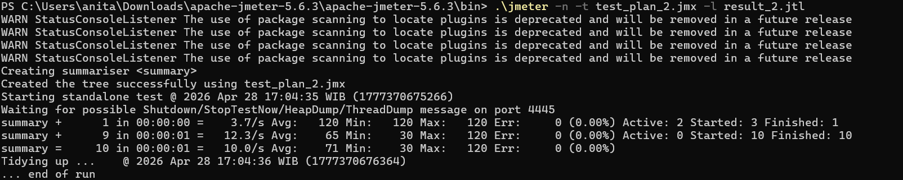
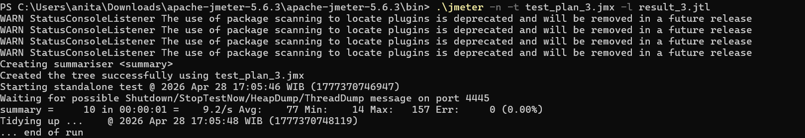
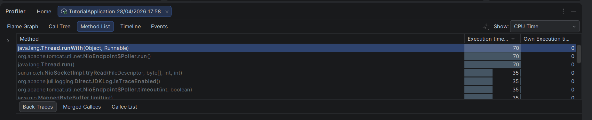
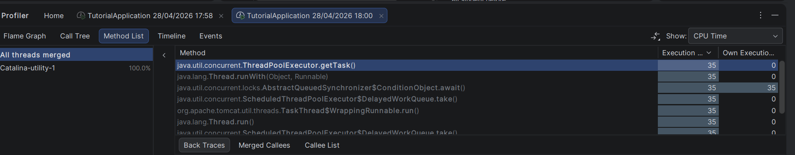
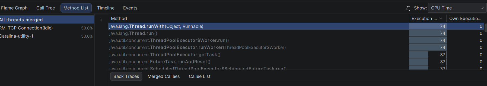
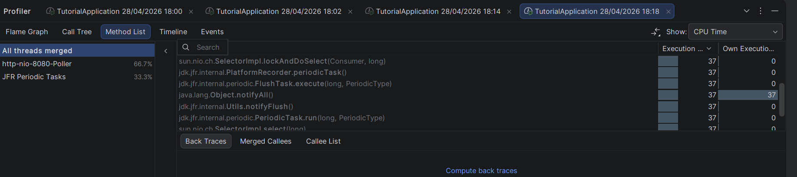
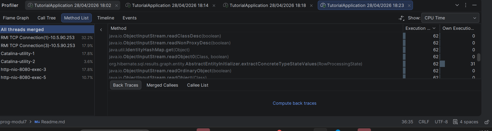
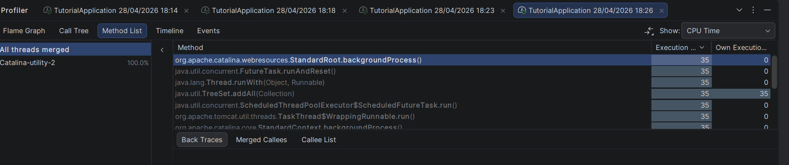

# Exercise Profiling

## Hasil Performance Testing

### Sebelum Optimasi

#### JMeter GUI - /all-student

#### JMeter GUI - /all-student-name

#### JMeter GUI - /highest-gpa

### JMeter CLI - Sebelum Optimasi

#### /all-student

#### /all-student-name

#### /highest-gpa

### JMeter CLI - Setelah Optimasi

#### /all-student

#### /all-student-name

#### /highest-gpa

### Kesimpulan
Setelah dilakukan optimasi pada kode, terjadi peningkatan performa yang signifikan
pada ketiga endpoint. Hal ini terlihat dari berkurangnya Sample Time pada hasil
pengujian JMeter setelah optimasi dibandingkan sebelum optimasi.

---

## Reflection

### 1. Perbedaan JMeter dan IntelliJ Profiler
JMeter berfokus pada pengujian performa dari sisi eksternal dengan mensimulasikan
banyak pengguna yang mengirim request ke aplikasi, mengukur response time,
throughput, dan error rate dari luar. Sedangkan IntelliJ Profiler menganalisis
perilaku internal aplikasi seperti penggunaan CPU, alokasi memori, dan waktu
eksekusi setiap method. JMeter memberi tahu kita "apa" yang lambat, sementara
IntelliJ Profiler memberi tahu "mengapa" dan "di mana" kode yang lambat tersebut.

### 2. Bagaimana profiling membantu mengidentifikasi kelemahan aplikasi
Profiling membantu dengan menunjukkan method mana yang paling banyak mengonsumsi
CPU time dan memori. Melalui Flame Graph dan Method List di IntelliJ Profiler,
saya dapat langsung melihat method mana yang menjadi bottleneck. Contohnya, saya
menemukan bahwa getAllStudentsWithCourses() menyebabkan masalah N+1 query karena
melakukan query ke database untuk setiap student dalam sebuah loop.

### 3. Efektivitas IntelliJ Profiler
Ya, IntelliJ Profiler sangat efektif. Tool ini menyediakan visualisasi detail
melalui Flame Graph, Call Tree, dan Method List yang memudahkan identifikasi
bottleneck. Fitur perbandingan antara dua sesi profiling juga membantu mengukur
persentase peningkatan yang tepat setelah optimasi dilakukan.

### 4. Tantangan utama dan cara mengatasinya
Tantangan utama yang dihadapi:
- Menunggu proses seeding data selesai (diatasi dengan mengurangi NUMBER_OF_STUDENTS)
- Memahami metrik mana yang perlu difokuskan (diatasi dengan fokus pada CPU Time
  di Method List)
- Memastikan JIT compiler sudah warm-up sebelum pengukuran (diatasi dengan
  mengakses endpoint beberapa kali sebelum mengambil pengukuran)

### 5. Manfaat utama IntelliJ Profiler
- Dapat melihat CPU time yang tepat per method
- Flame Graph memudahkan identifikasi hotspot secara visual
- Fitur comparison view menunjukkan persentase peningkatan yang tepat
- Terintegrasi langsung di dalam IDE sehingga tidak memerlukan tools eksternal
- Dapat menganalisis penggunaan CPU dan memori secara bersamaan

### 6. Menangani ketidakkonsistenan antara JMeter dan IntelliJ Profiler
Ketika hasil tidak konsisten, saya memprioritaskan pencarian akar masalah dengan
membandingkan kedua tools. JMeter mengukur response time end-to-end termasuk
network latency, sedangkan IntelliJ Profiler hanya mengukur waktu eksekusi kode.
Ketidakkonsistenan dapat terjadi karena JIT compiler warm-up, garbage collection,
atau overhead koneksi database. Saya menjalankan beberapa kali pengujian untuk
mendapatkan rata-rata yang konsisten sebelum mengambil kesimpulan.

### 7. Strategi optimasi setelah analisis
Setelah analisis, saya mengimplementasikan optimasi berikut:
- Mengganti N+1 query dengan single query (getAllStudentsWithCourses)
- Menggunakan StringBuilder sebagai pengganti string concatenation (joinStudentNames)
- Menggunakan query di level database daripada memuat semua data ke memori
  (findStudentWithHighestGpa)

Untuk memastikan fungsionalitas tidak terpengaruh, saya memverifikasi bahwa:
- Semua endpoint masih mengembalikan data yang benar setelah optimasi
- Aplikasi berjalan tanpa error
- Data response sesuai dengan output yang diharapkan